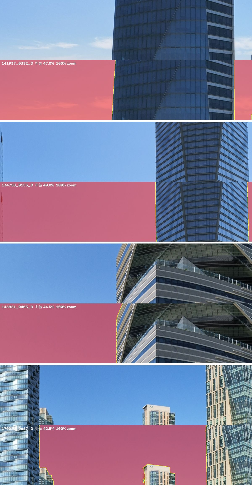
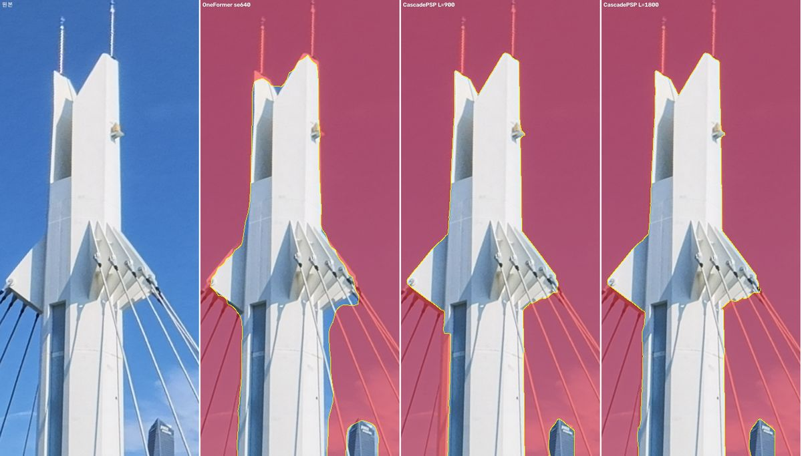
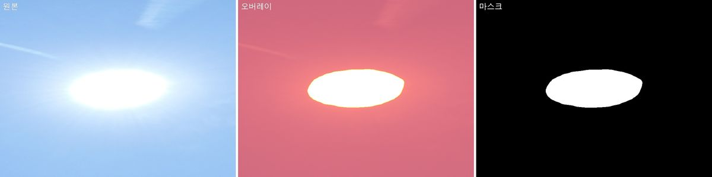
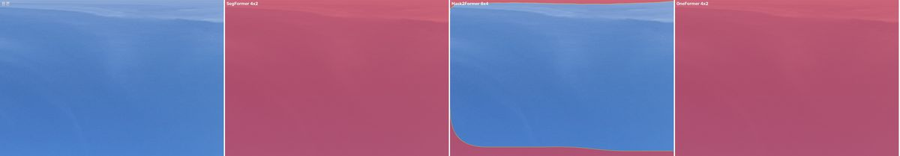

# semantic-mask — ERP 파노라마 하늘 마스크

360° 등장방형(ERP) 항공 파노라마에서 **하늘을 마스크로 빼낸다.**
3D Gaussian Splatting · COLMAP · NeRF 학습에서 하늘을 손실에서 제외하는 용도다.

하늘이 학습에 들어가면 무한원점의 밝은 면이 카메라 앞 몇 미터에 가우시안으로 앉는다.
그 유령층이 건물 파사드를 가린다. 처음부터 빼는 편이 싸다.

**마스크 규약: `0` = 하늘(제외), `255` = 유지.** 원본과 1:1 해상도 PNG.

실측 대상은 DJI 항공 ERP 파노라마 **7776×3888, 875장**이다.
같은 스크립트로 일반 핀홀 사진과 하늘 외 대상(수면·사람·차량)도 처리한다 — [아래](#하늘-말고-다른-대상).

---

## 결과



무작위 4프레임. 각 쌍의 위가 원본, 아래가 마스크 오버레이(빨강 = 제외, 노랑 = 경계선).

| 항목 | 값 |
|---|---|
| 경계 3px 이내 | 평균 **95.2%** · 중앙값 95.7% |
| 천정(맨윗줄) 누락 | 0.000% |
| 좌우 이음새 불일치 | 평균 0.037% |
| 과노출 태양 제거 | 139/139 프레임 |
| 하늘 면적 | 44.6% (34.0~49.5%) |

### 경계 정련



원본 · 분할 결과 · 정련 후. 분할만으로는 경계가 무디다.
정련을 거치면 경계가 실제 구조물 모서리에 붙는다 — 3px 이내 **68% → 98%**.

### 과노출 태양



태양은 하얗게 날아가 하늘로 판정되지 않는다. 875장 중 139장에서 나타났다.
후처리가 "하늘 한복판에 떠 있는 조각"으로 걸러 제거한다.

### 모델에 따라 실패하는 곳이 다르다



같은 프레임, 다른 모델. 가운데는 엷은 구름을 하늘로 보지 않아 큰 구멍을 남긴다.
오른쪽(OneFormer)은 정상이다. 몇 장만 보고 모델을 고르면 위험하다.

---

## 실행 환경

### 검증 기기

| | |
|---|---|
| GPU | **NVIDIA RTX 3080 Ti 12GB** (SM 8.6) |
| CPU / RAM | AMD Ryzen 9 3950X 16C · 128GB |
| OS | Windows 11 Pro |
| Python | 3.12.9 |
| PyTorch | 2.13.0+cu126 |

**12GB 가 기준선이다.** 분할은 1.8GB로 가볍고, 정련이 7GB를 쓴다.
정련 창(`--L`)을 900에서 1400으로 올리면 카드가 차면서 **프레임당 12.5초가 94.6초로 튄다** — 손잡이가 아니라 절벽이다.
GPU는 사실상 필수다. CPU로도 돌지만 실용 속도가 아니다.

### 단계별 실측 (7776×3888 · 875장 · 위 기기)

| 단계 | 스크립트 | 시간 | VRAM | 비고 |
|---|---|---|---|---|
| 패스1 분할 | `segment.py` | 15분 | 1.8GB | 4워커 병렬 |
| 패스2 경계정련 | `refine.py` | 3시간 | 7.0GB | **단일 워커가 빠르다** |
| 패스3 이음새 복구 | `seam.py` | 64분 | 7.0GB | ERP 전용 |
| 패스4 후처리 | `post.py` | 15분 | — | CPU만 |

12GB 미만이면 `refine.py --L 700` 으로 낮춰라. `check_env.py` 가 카드를 보고 알려준다.

산출 용량은 마스크 장당 약 45KB, 단계당 약 40MB, 중간 산출물 4단계 전체 약 160MB.
**중간 산출물은 지우지 마라** — 설정을 바꿀 때 모델 재실행 없이 다시 만든다.

---

## 설치

### 1. PyTorch — 직접 고른다

GPU와 드라이버에 맞는 빌드를 [pytorch.org](https://pytorch.org/get-started/locally/) 에서 고른다.
검증 조합은 CUDA 12.6 이다.

```bash
pip install torch torchvision --index-url https://download.pytorch.org/whl/cu126
```

### 2. 나머지 — pip 세 줄

```bash
pip install transformers opencv-python-headless pillow numpy
pip install --no-deps segmentation-refinement
pip install requests
```

`segmentation-refinement` 는 반드시 `--no-deps` 로 넣어라.
의존성을 풀면 opencv/torch 를 제 버전으로 갈아엎는다.
대신 `requests` 는 따로 넣어야 한다 — `--no-deps` 로 빠지는데 모델 다운로드에 쓴다.

검증된 버전:

| 패키지 | 버전 | 역할 |
|---|---|---|
| torch / torchvision | 2.13.0+cu126 / 0.28.0+cu126 | 추론 |
| transformers | 5.15.0 | OneFormer 로더 |
| opencv-python-headless | 5.0.0.93 | 연결성분·모폴로지 |
| pillow | 12.3.0 | 대용량 이미지 I/O |
| numpy | 2.5.2 | |
| segmentation-refinement | 0.6 | CascadePSP |
| requests | — | CascadePSP 가중치 다운로드 |

**가상환경 약 5.1GB** — 그중 torch 가 3.9GB다.

### 3. 모델 — 자동으로 받는다

첫 실행 때 코드가 알아서 내려받는다. 별도 조작이 없다.

| 모델 | 용량 | 받는 위치 |
|---|---|---|
| OneFormer Swin-L (ADE20K) | **1.64GB** | `~/.cache/huggingface/hub/` |
| CascadePSP | **271MB** | `~/.segmentation-refinement/model` |

선택 모델(비교용, 기본 경로에선 안 받음): Mask2Former Swin-L 827MB, SegFormer-B4 490MB.

**환경 + 모델 합쳐 약 7GB** 를 잡아두면 된다.

### 4. 확인

```bash
python scripts/check_env.py
```

없는 것과 넣는 명령을 알려준다. CUDA 가용 여부, 카드 이름, VRAM, 현재 여유를 함께 찍는다.

### 맨몸 윈도우에서 한 번에

파이썬조차 없는 기계라면 위 1~4를 대신 해주는 스크립트가 있다.

```powershell
.\scripts\bootstrap.ps1                    # 진단 + 설치 계획만. 아무것도 바꾸지 않는다
.\scripts\bootstrap.ps1 -Yes -FetchModels  # 동의 후 실제 설치
```

플래그 없이 실행하면 **무엇을 얼마나 받고 어디에 까는지**만 출력하고 끝난다.
`-Yes` 를 붙여야 실행한다.

```
[환경 진단]
  winget   v1.28.240
  GPU      NVIDIA GeForce RTX 3080 Ti   VRAM 12GB   드라이버 610.47   CUDA 13.3
  python   없음 또는 3.10~3.15 밖
  가상환경 ...\.venv-seg   (새로 만듦)

[설치 계획]
  Python 3.12 (winget)     다운   25.0MB   디스크  120.0MB
  torch + torchvision      다운    2.5GB   디스크    3.9GB
  transformers 외 4종      다운  150.0MB   디스크    1.2GB
  OneFormer Swin-L         다운    1.6GB   디스크    1.6GB
  CascadePSP               다운  271.0MB   디스크  271.0MB
  합계                     다운    4.6GB   디스크    7.1GB
```

`nvidia-smi` 는 그래픽 드라이버와 함께 깔리므로 파이썬 없이도 읽힌다.
드라이버 버전을 보고 CUDA 휠(cu126 / cpu)을 스스로 고른다.

파이썬은 있고 패키지만 빠졌다면 `check_env.py --install` 이 같은 방식으로 동작한다
(계획만 출력 → `--install --yes` 로 실행).

---

## 스킬로 설치

Claude Code 스킬이다. 스킬 폴더에 그대로 클론하면 끝이다.

```bash
git clone https://github.com/simiroa/Mask_skill.git ~/.claude/skills/semantic-mask
```

프로젝트 단위로 쓰려면 `.claude/skills/semantic-mask` 에 클론한다.
매니페스트도 등록 절차도 없다. README·LICENSE·docs 가 같이 있어도 무방하다.

이후 "이 폴더 하늘 마스크 만들어줘" 라고 하면 Claude 가 `SKILL.md` 를 읽고
선행 질문 → 환경 검사 → 소스 분석 → 샘플 비교 → 처리 → 검증 순으로 진행한다.

스킬 없이 스크립트만 써도 된다. 아래가 전부다.

---

## 실행

```bash
PY=python                    # ← CUDA 가 있는 인터프리터
S=scripts
IMG=/경로/ERP

$PY $S/check_env.py                              # 0. 환경 검사
$PY $S/analyze.py  $IMG --target sky             # 1. ERP 판별 + 시간·용량 추정
$PY $S/segment.py  $IMG coarse/ --target sky     # 2. 분할
$PY $S/refine.py   $IMG coarse/ fine/ --L 900    # 3. 경계 정련
$PY $S/seam.py     $IMG coarse/ fine/ seamed/    # 4. 이음새 복구 (ERP 전용)
$PY $S/post.py     coarse/ seamed/ final/ --target sky --max-grow 5
$PY $S/compare.py  $IMG --masks 성긴=coarse/ 최종=final/ --pick 3
$PY $S/verify.py   $IMG final/ --target sky      # 6. 판정 줄 확인
```

ERP 가 아니면 4단계를 건너뛰고 `post.py coarse/ fine/ final/` 로 이어간다.
`analyze.py` 가 종횡비를 보고 알려준다.

모든 단계가 **절대경로 · 용량 · 예상 시간**을 함께 낸다.

```
[소스 분석]
  이미지    D:\DJI_001\data\ERP   (875개, 13.3GB)
  875장 전량: 패스1 51.1분, 정련 3.0시간, 이음새 1.1시간(ERP만), 후처리 14.6분
용량 추정   마스크 1장 약 59.0KB  ->  단계당 50.5MB
  중간 산출물 4단계 유지 시 총 201.8MB  (출력 예정 드라이브 여유 190.3GB)
```

진행 중에는 남은 시간과 완료예정시각이, 끝나면 출력 절대경로와 산출 용량이 찍힌다.
`verify.py` 는 "판정: 통과 / 실패" 한 줄로 끝난다. 통과 전에는 확정하지 마라.

---

## ERP 를 위해 따로 하는 일

등장방형(2:1) 파노라마는 좌우 끝이 이어져 있다. 두 가지를 처리한다.

**타일링이 가로를 감는다.** 3천만 화소를 한 번에 못 넣어 4×2로 쪼개 추론하는데,
오른쪽 끝 타일이 왼쪽 끝 화소를 함께 본다. 일반 프레임에 이걸 켜면 화면 좌우 끝을
같은 장면으로 착각한다. 종횡비로 자동 판정한다.

**정련 후 이음새를 복구한다.** 정련기(CascadePSP)는 파노라마인 걸 모르고 좌우 끝을
따로 다듬어 어긋난다. 실측에서 이렇게 깨졌다:

| 단계 | 평균 불일치 | 최대 | 1% 초과 |
|---|---|---|---|
| 패스1 (감기 타일링) | 0.061% | — | 14장 |
| 정련 직후 | **1.076%** | **13.04%** | **236장** |
| 이음새 복구 후 | 0.037% | 2.49% | 5장 |

앞 단계의 전제는 뒤 단계로 자동으로 따라가지 않는다. 단계를 붙일 때마다 다시 검증하라.

---

## 알려진 한계

- **유리 커튼월** — 하늘을 반사하는 면을 정련이 세로로 파먹는다. 마스크 연산으로는 못 고친다.
- **흐린 원경** — 대기 원근으로 대비가 사라진 스카이라인은 뭉개진다. 정련이 75→85%까지 회복하고 거기서 멈춘다.
- **입력 해상도를 올리면 오히려 나빠진다** — 학습 분포를 벗어난다. VRAM 문제가 아니다.

산출물은 두 벌을 권한다. **본판**(경계 정밀도 우선)과 **넉넉본**(성긴 마스크 그대로,
구조물 보존 우선). 정련이 만드는 실패가 성긴 마스크엔 없다.

수치와 근거, 기각된 접근들은 [`REFERENCE.md`](REFERENCE.md) 에 있다.

---

## 하늘 말고 다른 대상

`--target` 만 바꾸면 된다. ADE20K 150클래스를 쓴다.

| 대상 | 내용 |
|---|---|
| `sky` | 하늘 (**대규모 실측은 이것만 했다**) |
| `water` | 물·바다·강·호수·수영장 |
| `people` | 사람 |
| `vehicles` | 차·버스·트럭·오토바이·자전거 |
| `movers` | 사람 + 차량 (이동체 제거용) |
| `vegetation` | 나무·풀 |
| `ground` | 도로·땅·모래 |
| `building` | 건물 |
| `c:<번호>` | 클래스 직접 지정 |

대상마다 후처리 정책이 다르다. 하늘은 "떠 있는 조각 = 오검출(태양)"이지만,
사람·차는 그 자체가 떠 있는 조각이라 같은 규칙을 쓰면 대상을 지운다.
프리셋이 이 차이를 처리한다. `python scripts/targets.py` 로 확인한다.

---

## 원천 소스

**이 저장소의 모델과 알고리즘은 전부 아래 연구자들의 것이다.**
여기서 만든 것은 대량 처리 파이프라인, 파노라마 대응, 검증 절차뿐이다.

| 구성요소 | 출처 | 라이선스 |
|---|---|---|
| **OneFormer** (기본 분할 모델) | [SHI-Labs/OneFormer](https://github.com/SHI-Labs/OneFormer) · [모델](https://huggingface.co/shi-labs/oneformer_ade20k_swin_large) | MIT |
| **CascadePSP** (경계 정련) | [hkchengrex/CascadePSP](https://github.com/hkchengrex/CascadePSP) | MIT |
| **Mask2Former** (선택) | [모델](https://huggingface.co/facebook/mask2former-swin-large-ade-semantic) | 모델 카드 확인 |
| **SegFormer** (선택) | [모델](https://huggingface.co/nvidia/segformer-b4-finetuned-ade-512-512) | 모델 카드 확인 |
| **ADE20K** (클래스 정의) | [MIT Scene Parsing](https://groups.csail.mit.edu/vision/datasets/ADE20K/) | 데이터셋 조건 확인 |
| **transformers** | [huggingface/transformers](https://github.com/huggingface/transformers) | Apache-2.0 |
| **PyTorch** | [pytorch/pytorch](https://github.com/pytorch/pytorch) | BSD-3 |

비교 과정에서 함께 시험한 것들(이 저장소에 포함되지 않음):
[SegRefiner](https://github.com/MengyuWang826/SegRefiner) (Apache-2.0),
[ViTMatte](https://huggingface.co/hustvl/vitmatte-base-composition-1k) (Apache-2.0),
[SAM 3](https://huggingface.co/facebook/sam3),
[Depth Anything V2](https://huggingface.co/depth-anything/Depth-Anything-V2-Large-hf).

선택 모델 중 Mask2Former·SegFormer 체크포인트는 라이선스가 `other` 로 표기돼 있다.
상업적 이용 전에 각 모델 카드를 직접 확인하라.

이 저장소의 코드는 [MIT](LICENSE) 다.
